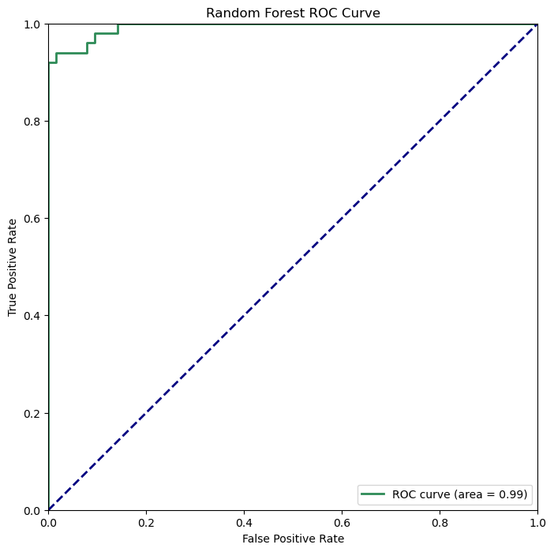
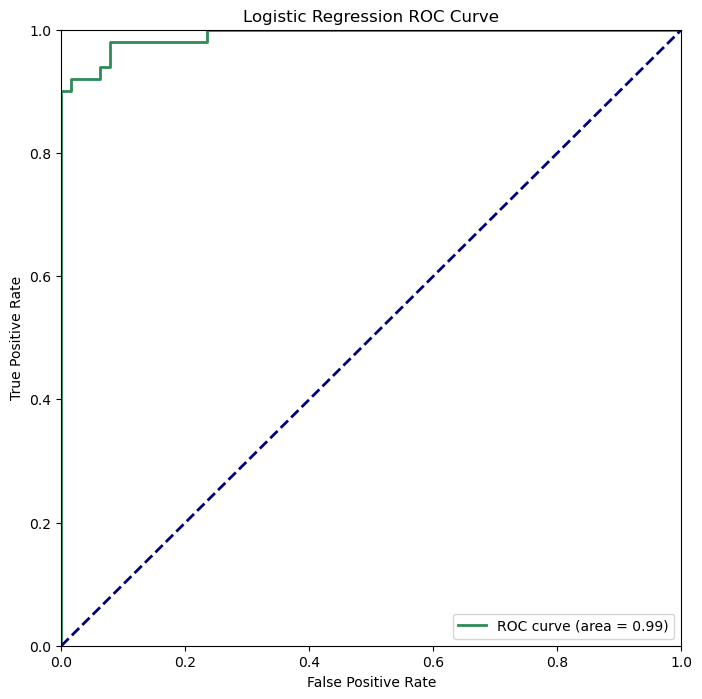

# Cancer Diagnosis using Machine Learning

### Data set:

- Labels: B (benign), M (Malignant)
- Features: 20 clinical variables
- 569 samples

## Algorithms

In this project, I employed two classification algorithms, Random Forest and Logistic Regression, for the task of cancer diagnosis. The selection of these algorithms is based on the characteristics of the problem and the nature of the dataset.

- **Random Forest:** Random Forest is an ensemble learning method that builds multiple decision trees and merges their predictions. It is well-suited for complex datasets with multiple features, handles non-linearity well, and is less prone to overfitting. This makes it a strong candidate for medical diagnosis problems where feature interactions and non-linear relationships might be present.

- **Logistic Regression:** Logistic Regression is a simple yet effective algorithm for binary classification problems. It models the probability of a binary outcome and is interpretable. Logistic Regression is often used as a baseline model and can provide insights into the importance of features in the dataset.

## Training Procedure

### Data Preparation

The dataset was loaded using PySpark, and missing values were checked and handled appropriately.

### Feature Engineering

The "diagnosis" column (target variable) was converted from string to numeric using StringIndexer.
Feature columns were assembled into a vector using VectorAssembler.

### Model Training

The data was split into training and test sets (75% training, 25% test) using the randomSplit method.
Two classification models, Random Forest and Logistic Regression, were trained using PySpark's MLlib.

## Testing Results

### Evaluation Metrics

The models were evaluated using BinaryClassificationEvaluator for AUC and MulticlassClassificationEvaluator for F1 Score, Precision, and Recall.

#### Random Forest:

- **AUC:** 0.9934375
- **F1 Score:** 0.9648241482827948
- **Precision:** 0.9653442317916001
- **Recall:** 0.9649122807017545
- **ROC Curve:** 

#### Logistic Regression:

- **AUC:** 0.9906250000000001
- **F1 Score:** 0.7939541160593793
- **Precision:** 0.8563851489188086
- **Recall:** 0.8070175438596492
- **ROC Curve:** 

### Comparison of Algorithms

#### Random Forest:

- Random Forest tends to provide high accuracy due to the aggregation of multiple decision trees.
- The ensemble nature of Random Forest, combining multiple weak learners, makes it less prone to overfitting.
- Training multiple decision trees can be computationally expensive, especially for large datasets.

#### Logistic Regression:

- Logistic Regression is computationally less intensive compared to complex ensemble methods, making it faster to train.
- Logistic Regression is less likely to overfit the data, especially when dealing with a limited number of features.
- Logistic Regression can be sensitive to outliers, affecting the model's performance.

## Limitations

- The performance of the models depends on the quality of the features and the representativeness of the dataset.
- The choice of algorithms might not be optimal for all scenarios; other algorithms could be explored based on the specific characteristics of the data.

## Potential Improvements

- Feature engineering could be further refined to capture additional information.
- Hyperparameter tuning may improve the performance of the models.
- Ensemble methods or more complex algorithms could be explored for increased predictive power.
